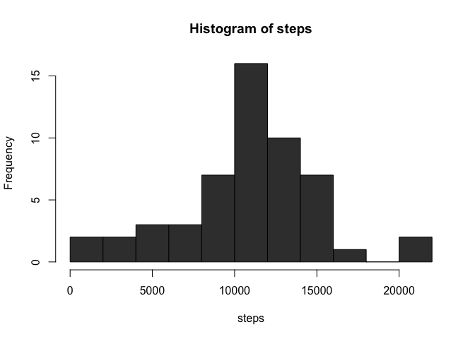

# Reproducible Research: Peer Assessment 1

This assignment makes use of data from a personal activity monitoring device. This device collects data at 5 minute intervals through out the day. The data consists of two months 
of data from an anonymous individual collected during the months of October and November, 
2012 and include the number of steps taken in 5 minute intervals each day.

The data for this assignment can be downloaded from the course web site:

* **Dataset:** Activity monitoring data [52K]

The variables included in this dataset are:

* **steps:** Number of steps taking in a 5-minute interval (missing values are coded as 𝙽𝙰)
* **date:** The date on which the measurement was taken in YYYY-MM-DD format
* **interval:** Identifier for the 5-minute interval in which measurement was taken

The dataset is stored in a comma-separated-value (CSV) file and there are a total of 
17,568 observations in this dataset.


## Loading and preprocessing the data
For this exercise, I download the zip file directly from the web. The dataset
was accessed on 10 Jan 2016 and the code below run properly at that time. The zip file is
then unzipped and the resulting csv file read as a data.table using the **fread( )**
function from the **data.table** package. To facilitate my analyses, I converted the 
date variable into a POSIXct object using the **ymd( )** function from the **lubridate**
package.


```r
# Load packages for the session 
require(data.table)
```

```
## Loading required package: data.table
```

```r
require(lubridate)
```

```
## Loading required package: lubridate
## 
## Attaching package: 'lubridate'
## 
## The following objects are masked from 'package:data.table':
## 
##     hour, mday, month, quarter, wday, week, yday, year
```

```r
# Define working directory
dir <- "~/Documents/COURSERA/REPRODUCIBLE_RESEARCH/temp/"

# Set target file name
zip_file <- "http://d396qusza40orc.cloudfront.net/repdata%2Fdata%2Factivity.zip"

# Download file
download.file(zip_file,destfile=paste0(dir,"activity.zip"))

# Unzip file
csv_file <- unzip(paste0(dir,"activity.zip"))

# Read resulting csv
mydata <- fread(csv_file)

# Set date as POSIXct
mydata$date <- ymd(mydata$date)

# Data structure
str(mydata)
```

```
## Classes 'data.table' and 'data.frame':	17568 obs. of  3 variables:
##  $ steps   : int  NA NA NA NA NA NA NA NA NA NA ...
##  $ date    : POSIXct, format: "2012-10-01" "2012-10-01" ...
##  $ interval: int  0 5 10 15 20 25 30 35 40 45 ...
##  - attr(*, ".internal.selfref")=<externalptr>
```

## What is mean total number of steps taken per day?
In this step, I initially aggregate the dataset by date using the **aggregate()** function 
to determine the total number of steps per day. I ignore all missing values. Then, I 
create a histogram of the total number of steps per day. Finally, I calculate the mean
and median of the total number of steps taken per day.


```r
# Determine the total number of steps per day (i.e. unique date)
daily_steps <- aggregate(steps~date,data=mydata,sum)

# Create histogram of the total number of steps
with(daily_steps,hist(steps,col='gray23'))
```

 

```r
# Calculate mean and median steps taken per day (auto-print)
(mean_steps <- mean(daily_steps$steps))
```

```
## [1] 10766.19
```

```r
(median_steps <- median(daily_steps$steps))
```

```
## [1] 10765
```

## What is the average daily activity pattern?


## Imputing missing values


## Are there differences in activity patterns between weekdays and weekends?
