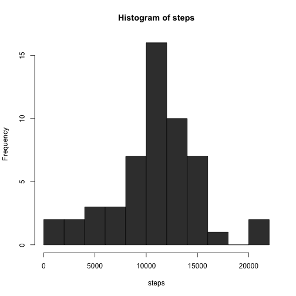
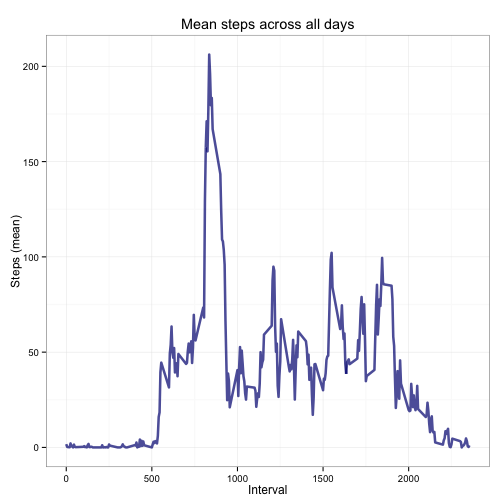
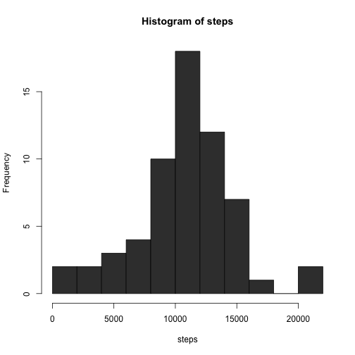
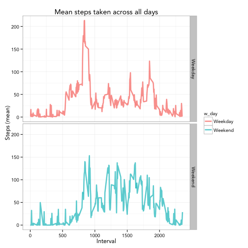

This assignment makes use of data from a personal activity monitoring device. This device collects data at 5 minute intervals through out the day. The data consists of two months 
of data from an anonymous individual collected during the months of October and November, 
2012 and include the number of steps taken in 5 minute intervals each day.

The data for this assignment can be downloaded from the course web site:

* **Dataset:** Activity monitoring data [52K]

The variables included in this dataset are:

* **steps:** Number of steps taking in a 5-minute interval (missing values are coded as 𝙽𝙰)
* **date:** The date on which the measurement was taken in YYYY-MM-DD format
* **interval:** Identifier for the 5-minute interval in which measurement was taken

The dataset is stored in a comma-separated-value (CSV) file and there are a total of 
17,568 observations in this dataset.


## Loading and preprocessing the data
For this exercise, I download the zip file directly from the web. The dataset
was accessed on 10 Jan 2016 and the code below run properly at that time. The zip file is
then unzipped and the resulting csv file read as a data.table using the **fread( )**
function from the **data.table** package. To facilitate my analyses, I converted the 
date variable into a POSIXct object using the **ymd( )** function from the **lubridate**
package.


```r
# Load packages for the session 
require(data.table)
```

```
## Loading required package: data.table
## data.table 1.9.4  For help type: ?data.table
## *** NB: by=.EACHI is now explicit. See README to restore previous behaviour.
```

```r
require(lubridate)
```

```
## Loading required package: lubridate
## 
## Attaching package: 'lubridate'
## 
## The following objects are masked from 'package:data.table':
## 
##     hour, mday, month, quarter, wday, week, yday, year
```

```r
require(dplyr)
```

```
## Loading required package: dplyr
## 
## Attaching package: 'dplyr'
## 
## The following objects are masked from 'package:lubridate':
## 
##     intersect, setdiff, union
## 
## The following objects are masked from 'package:data.table':
## 
##     between, last
## 
## The following objects are masked from 'package:stats':
## 
##     filter, lag
## 
## The following objects are masked from 'package:base':
## 
##     intersect, setdiff, setequal, union
```

```r
require(ggplot2)
```

```
## Loading required package: ggplot2
```

```r
# Some options for the session
options(scipen=100,width=80)

# Define working directory
dir <- getwd()

# Set target file name
zip_file <- "http://d396qusza40orc.cloudfront.net/repdata%2Fdata%2Factivity.zip"

# Download file
download.file(zip_file,destfile=paste0(dir,"activity.zip"))

# Unzip file
csv_file <- unzip(paste0(dir,"activity.zip"))

# Read resulting csv
mydata <- fread(csv_file)

# Set date as POSIXct
mydata$date <- ymd(mydata$date)

# Data structure
str(mydata)
```

```
## Classes 'data.table' and 'data.frame':	17568 obs. of  3 variables:
##  $ steps   : int  NA NA NA NA NA NA NA NA NA NA ...
##  $ date    : POSIXct, format: "2012-10-01" "2012-10-01" ...
##  $ interval: int  0 5 10 15 20 25 30 35 40 45 ...
##  - attr(*, ".internal.selfref")=<externalptr>
```

## What is mean total number of steps taken per day?
In this step, I initially aggregate the dataset by date using the **aggregate( )** 
function to determine the total number of steps per day. I ignore all missing values. 
Then, I create a histogram of the total number of steps per day. Finally, I calculate 
the mean and median of the total number of steps taken per day.


```r
# Determine the total number of steps per day (i.e. unique date)
daily_steps <- aggregate(steps~date,data=mydata,sum)

# Create histogram of the total number of steps
with(daily_steps,hist(steps,col='gray23',breaks=15))
```

 

```r
# Calculate mean and median steps taken per day (auto-print)
(mean_steps <- mean(daily_steps$steps))
```

```
## [1] 10766.19
```

```r
(median_steps <- median(daily_steps$steps))
```

```
## [1] 10765
```

The mean number of steps is 10766 and the median is 10765

## What is the average daily activity pattern?
In this section I make a time series plot (with **ggplot( )**) of the 5-minute interval 
(x-axis) and the average number of steps taken, averaged across all days (y-axis). Then,
I determine which 5-minute interval, on average across all the days in the dataset, 
contains the maximum number of steps.


```r
# Calculate the average number of steps taken at each interval across all days
interval_steps <- aggregate(steps~interval,data=mydata,mean)

# Generate time series plot with ggplot()
myplot <- ggplot(interval_steps,aes(interval,steps)) +
       geom_line(size=1.2,alpha=0.7,colour="navy") +
       theme_bw(base_family="Arial") + 
       labs(x="Interval",y="Steps (mean)") + 
       labs(title=expression("Mean steps across all days"))
print(myplot)
```

 

```r
# Determine which interval has the maximum number of steps
interval_steps$interval[which.max(interval_steps$steps)]
```

```
## [1] 835
```

The maximum number of steps across all days is at 08:35 am

## Imputing missing values
It is noted that there are a number of days/intervals where there are missing values
(coded as **NA**). The presence of missing data may introduce bias into some calculations
or summaries of the dataset. Consequently, here, I calculate and report the total number 
of missing values in the dataset (i.e. the total number of rows with **NA**). 

I use a strategy for filling in all of the missing values in the dataset taken from
Gelman & Hill (2007), *Data Analysis Using Regression and Multilevel/Hierarchical Models*, 
Ch 25, Cambridge University Press. LaThis strategy consists on randomly imputing missing 
values taken a sample from the observe data. Later, I create a new dataset that is equal 
 the 
oiginal dataset but with the missing data filled in. I also generate a histogram of
of the total number of steps taken each day. Finally, I calculate and report the mean and 
median total number of steps taken per day. Do these values differ from the estimates from 
the rst part of the assignment? What is the impact of imputing missing data on the es
estimates  the total daily number of steps?


```r
# Calculate the total number of missing values
(missing <- sum(is.na(mydata)))
```

```
## [1] 2304
```

```r
# Create function for random imputation 
impute <- function (x){
       missing <- is.na(x)
       n_missing <- sum(missing)
       x_obs <- x[!missing]
       imputed <- x
       set.seed(4321) # to make it reproducible
       imputed[missing] <- sample(x_obs,n_missing,replace=TRUE)
       return (imputed)
       }

# Impute data using random imputation 
imputed_steps <- impute(mydata$steps)

# Create new dataset with missing data filled in
newdata <- mydata
newdata$steps <- imputed_steps

# Generate histogram of total steps taken each day
total_steps <- aggregate(steps~date,data=newdata,sum) # total steps

# Create histogram of the total number of steps
with(total_steps,hist(steps,col='gray23',breaks=15))
```

 

```r
# Calculate mean and median steps taken per day (auto-print)
(mean_steps <- mean(total_steps$steps))
```

```
## [1] 10729.33
```

```r
(median_steps <- median(total_steps$steps))
```

```
## [1] 10765
```

As can be observed from the data above, the imputation caused a small reduction on the 
mean number of steps taken each day. The impact on the median, on the other hand was
nill.


## Are there differences in activity patterns between weekdays and weekends?
For this part, I use the dataset with the filled-in missing values. I create a new 
factor variable in the dataset with two levels – “weekday” and “weekend” indicating
whether a given date is a weekday or weekend day. Then, I generate a panel plot containing 
a time series plot of the 5-minute interval (x-axis) and the average number of steps 
taken, averaged across all weekday days or weekend days (y-axis). 


```r
# Determine day of the week
wday <- lubridate::wday(newdata$date,label=TRUE)

# Define labels for weekend
wend <- c("Sat","Sun") 

# If day of the week is in "wend", label it weekend else weekday
newdata$w_day <- ifelse(wday%in%wend,"Weekend","Weekday")

# Aggregate data across interval and w_day
intervals_wday <- aggregate(steps~interval+w_day,data=newdata,mean)

# Generate time series panel plot
panel_plot <- ggplot(intervals_wday,aes(interval,steps)) +
       geom_line(aes(color=w_day),size=1.2,alpha=0.7) +
       theme_bw(base_family="Avenir") + 
       facet_grid(w_day~.) + 
       labs(x="Interval", y="Steps (mean)") + 
       labs(title="Mean steps taken across all days")
print(panel_plot)
```

 


As can be observed from the plot, there are differences in the activity patterns when
comparing weekdays vs. weekends.

